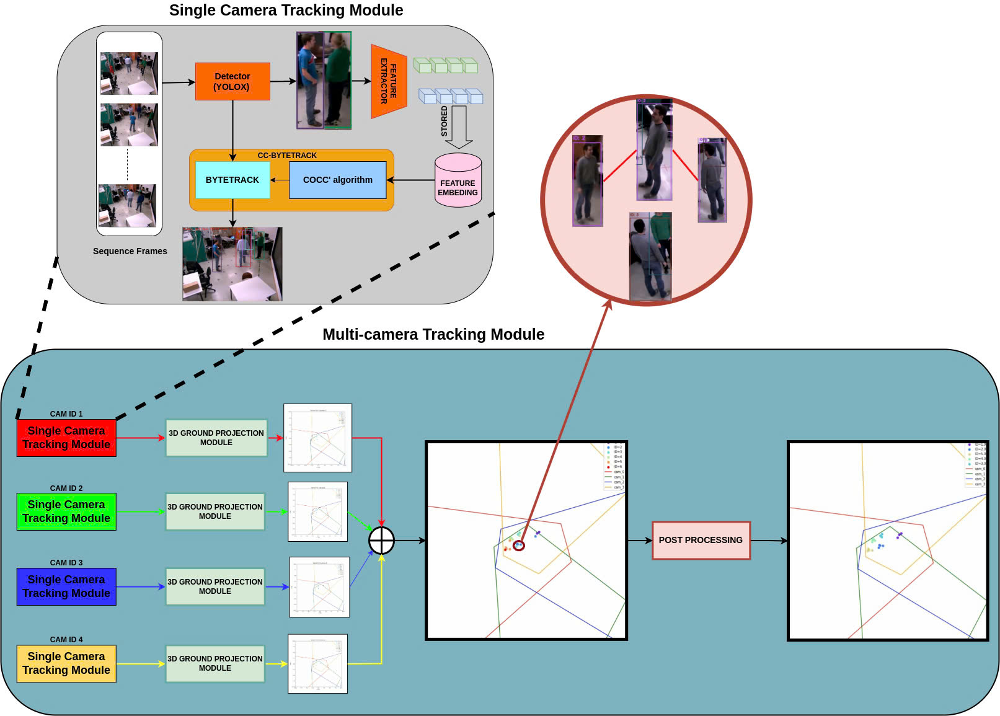

# Multi-Camera Multi-Object Tracking

[](https://www.python.org/)  
[](https://opencv.org/)  
[](LICENSE)

## Project Overview

**Multi-Camera Multi-Object Tracking** is a robust framework that extends object tracking from a single camera to a multi-camera environment. It builds upon [ByteTrack](https://github.com/ifzhang/ByteTrack) for high-performance tracking and incorporates two key enhancements:
- **Conflict-aware Cosine Tracking (CC)** for reducing ID switches within a single view.
- **Human Matching (HM) Algorithm** for assigning consistent global IDs across multiple views using spatial and appearance cues.


## Paper
If you'd like to read the full paper describing this work, click the link below:

➡️ [Our paper (IEEE Xplore)](https://ieeexplore.ieee.org/document/11133773)

## Pipeline Overview

1. **Single-Camera Tracking**  
   - Uses ByteTrack + CC algorithm for robust per-camera ID assignment.
2. **3D Localization**  
   - Projects 2D detections to ground-plane coordinates using camera intrinsics and extrinsics.
3. **Global ID Association**  
   - Applies the HM Algorithm to fuse appearance and spatial features for cross-view matching.



## Features

- **Improved Single-Camera Tracking**  
  - Integrated with `torchreid` for high-quality appearance embeddings.  
  - CC algorithm mitigates frequent ID switches.

- **3D Ground-Plane Estimation**  
  - Transforms bounding boxes to real-world coordinates.  
  - Works with arbitrary camera setups.

- **Multi-Camera Identity Association**  
  - HM Algorithm effectively assigns consistent global identities.  
  - Balances appearance similarity with spatial proximity.

## Prerequisites

- **Python:** >= 3.8  
- **OpenCV:** 4.x  
- **NumPy**  
- **TensorRT** (optional, for faster inference)  
- **torchreid** (for feature extraction)

### Installation
Install required packages via `pip`:
```bash
pip install opencv-python numpy tensorRT torchreid
```

## Dataset
This project is tested and evaluated on **ICGLab6** dataset, from Institute of Computer Graphics and Vision, Graz University of Technology, Austria. If you use this data, please cite this [paper](https://openaccess.thecvf.com/content_cvpr_2013/papers/Possegger_Robust_Real-Time_Tracking_2013_CVPR_paper.pdf).

## Implement
```bash
python tools/run_multicam_tracking.py
```

## Video Demo

Check out the demo video showcasing the system in action:  
➡️ [https://www.youtube.com/watch?v=Uq-M_70Ip8Y](https://www.youtube.com/watch?v=Uq-M_70Ip8Y)
